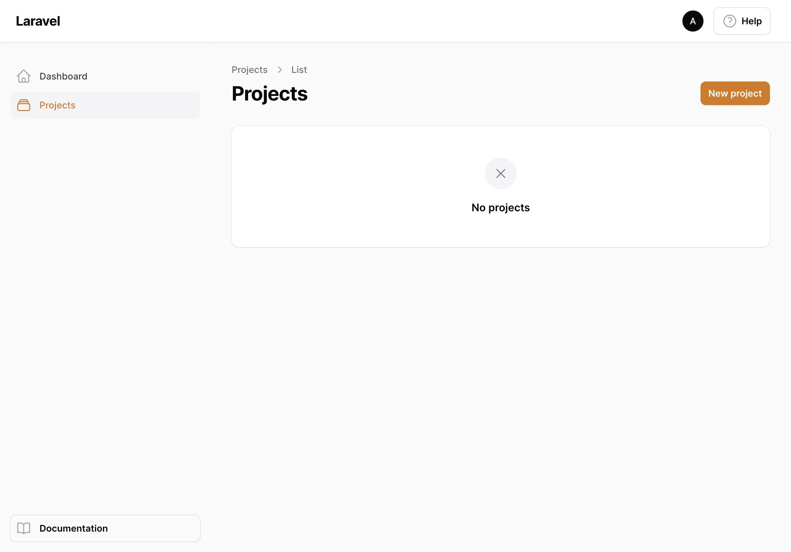
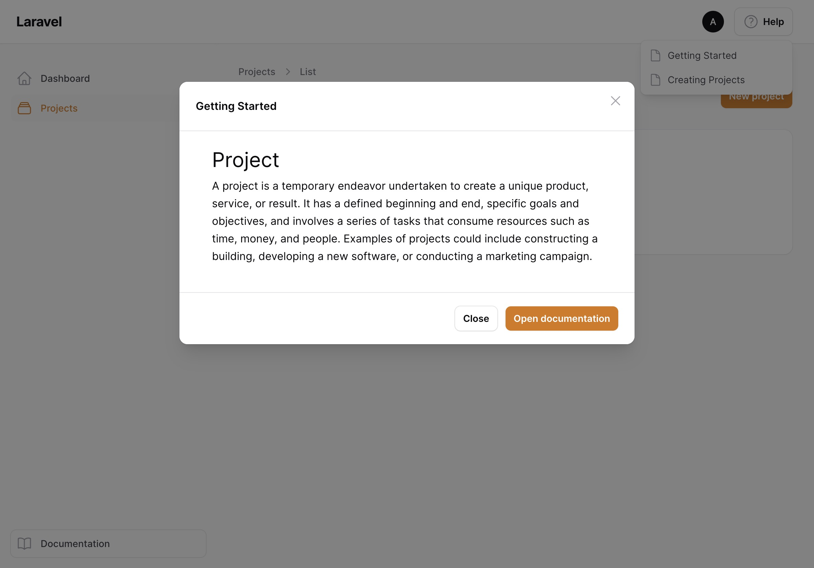

# Introduction

Knowledge Base turns a filament panel into a documentation site for your app. You write markdown files, and the package renders them as a fully navigable knowledge base with a sidebar, breadcrumbs, a table of contents and global search.

The package ships two plugins that work together:

- The `KnowledgeBasePlugin` is registered on a dedicated panel and turns it into the knowledge base itself.
- The `KnowledgeBaseCompanionPlugin` is registered on your regular panels and integrates them with the knowledge base: a help menu in the topbar, documentation previews in modals and a link to the knowledge base in the sidebar.

## Version compatibility

| Filament version | Plugin version |
|------------------|:--------------:|
| 3.x              |      1.x       |
| 4.x              |      2.x       |
| 5.x              |      3.x       |

For older filament versions, please check the branch of the respective version.
