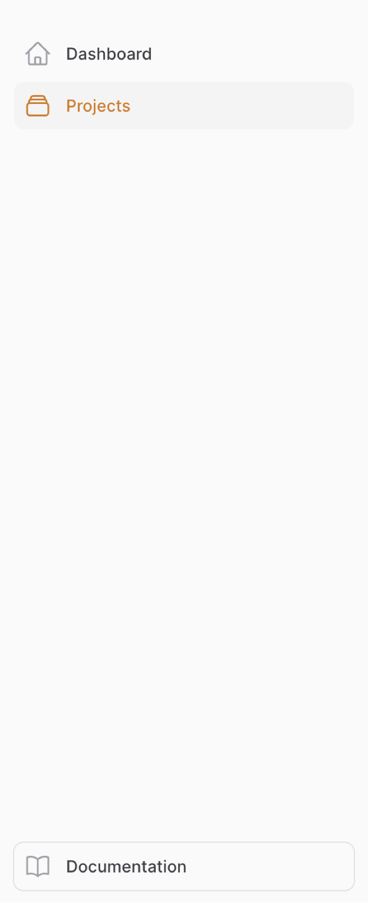

# Setup

Register the companion plugin on every regular panel that should integrate with your knowledge base, and tell it which panel the knowledge base is:

```php
use Guava\FilamentKnowledgeBase\Plugins\KnowledgeBaseCompanionPlugin;

public function panel(Panel $panel): Panel
{
    return $panel
        ->id('admin')
        ->path('admin')
        // ...
        ->plugins([
            KnowledgeBaseCompanionPlugin::make()
                ->knowledgeBasePanelId('knowledge-base'),
        ]);
}
```

> [!NOTE]
> The panel needs a custom theme with our source paths, just like the knowledge base panel itself. See [installation](../02-installation.md).

## The knowledge base button

The plugin renders a "Knowledge base" button at the bottom of the sidebar, linking to your knowledge base panel.



You can disable it:

```php
$plugin->disableKnowledgeBasePanelButton();
```

## Opening the knowledge base in a new tab

By default, links to the knowledge base (the sidebar button as well as help menu items) open in the same tab. To open them in a new tab instead:

```php
$plugin->openKnowledgeBasePanelInNewTab();
```
