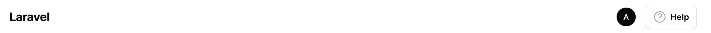

# Help menu

You will most likely have a section in your knowledge base dedicated to each of your resources, at least to the more complex ones. The help menu links the two together: it renders a help button in the topbar of exactly those resources and pages that have documentation.

## Linking a resource or page

Implement the `HasKnowledgeBase` contract on your resource or page and return the documentation from `getDocumentation()`. You can return IDs as strings (the dot-notation path inside your docs directory) or the models themselves:

```php
use Guava\FilamentKnowledgeBase\Contracts\HasKnowledgeBase;
use Guava\FilamentKnowledgeBase\Facades\KnowledgeBase;

class UserResource extends Resource implements HasKnowledgeBase
{
    // ...

    public static function getDocumentation(): array
    {
        return [
            'users.introduction',
            'users.authentication',
            KnowledgeBase::model()::find('knowledge-base.users.permissions'),
        ];
    }
}
```

If you return a single documentation page, the help button links to it directly. With more than one, it renders a dropdown menu.



Implementing the contract on a resource covers all its pages. You can also implement it on a single page (or any custom filament page) instead.

## Moving the help menu

By default the menu renders at the end of the topbar. You can move it to any [render hook](https://filamentphp.com/docs/5.x/advanced/render-hooks):

```php
use Filament\View\PanelsRenderHook;

$plugin->helpMenuRenderHook(PanelsRenderHook::TOPBAR_START);
```

## What clicking does

By default, a help menu item sends the user to the full documentation page in the knowledge base panel. If you enable [modal previews](03-modal-previews.md), the documentation opens in a modal instead, without leaving the page.
