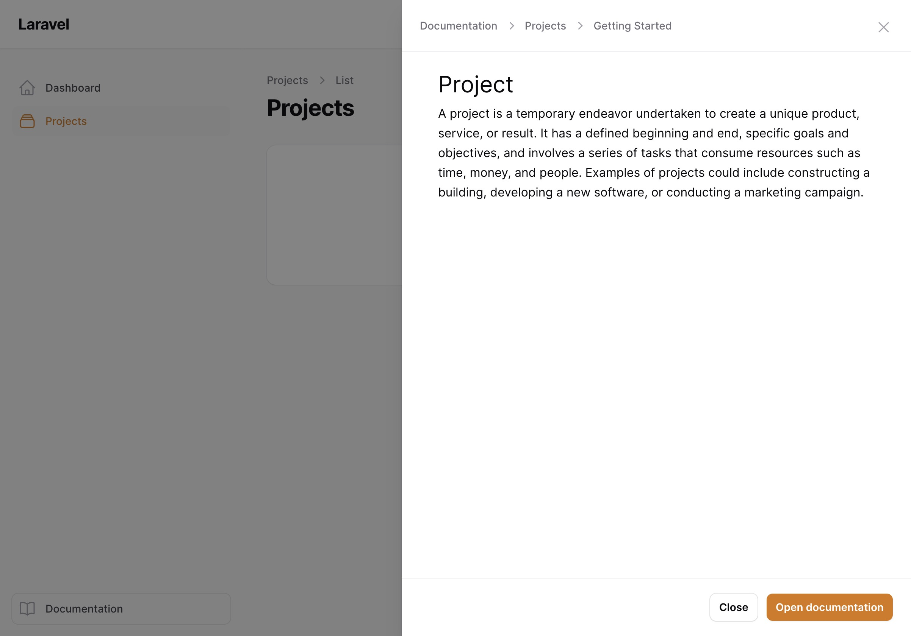
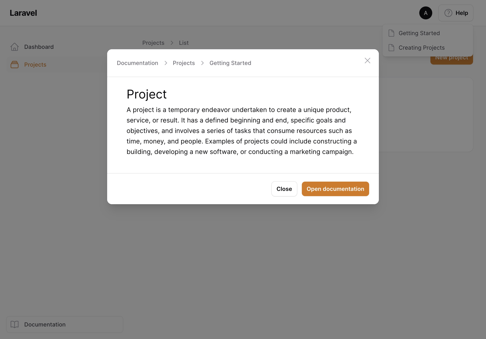

# Modal previews

Instead of sending your users to the knowledge base panel, you can render the documentation in a modal right inside your regular panel. This affects the [help menu](02-help-menu.md), [help actions](05-help-actions.md) and [modal links](04-modal-links.md).

Enable it on the companion plugin:

```php
$plugin->modalPreviews();
```


## Slide overs

If you prefer slide overs instead of centered modals, additionally enable:

```php
$plugin->slideOverPreviews();
```



## Breadcrumbs in the title

By default, the modal title is the title of the documentation page. If you'd rather show the full breadcrumb path:

```php
$plugin->modalTitleBreadcrumbs();
```



## Hiding the "Open documentation" button

Modal previews have a footer button linking to the full documentation page. If you only use the modal previews and don't expose the knowledge base panel to your users, you can remove it:

```php
$plugin->disableOpenDocumentationButton();
```
