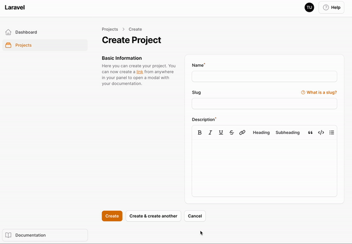

# Modal links

The companion plugin intercepts fragment links anywhere in your panel and opens the linked documentation in a modal.

Add a link **anywhere** in your panel with a fragment in the format `#modal-<documentation-id>`:

```html
<a href="#modal-users.introduction">Open Introduction</a>
```

As long as a documentation page with that [ID](../writing/02-front-matter.md#slug-and-id) exists, clicking the link opens it in a modal.

Since the fragment is part of the URL, you can even share the link with someone and the modal opens right away when they visit it.



## Disabling modal links

If you don't want the link interception:

```php
$plugin->disableModalLinks();
```
