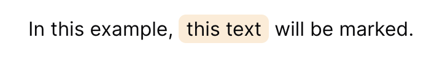
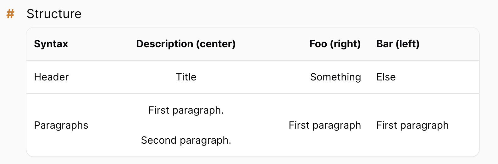
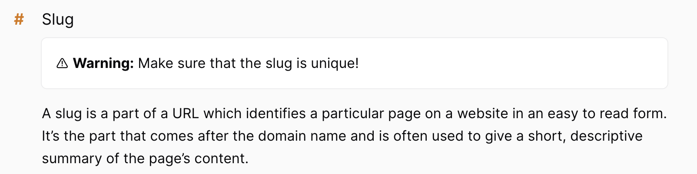
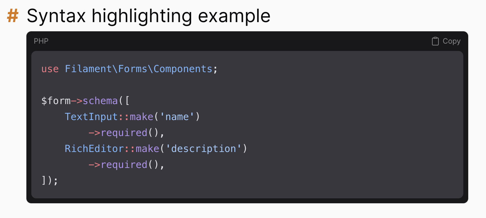

# Markdown

The content of your files is parsed with [league/commonmark](https://commonmark.thephpleague.com/), so everything from the [CommonMark spec](https://commonmark.org/) works: headings, lists, links, images, code blocks and so on.

On top of that, we add a few extensions of our own, described below.

## Markers

To highlight words in the primary color of your panel, wrap them in `==`:

```md
In this example, ==this text== will be marked.
```



## Tables

Regular markdown tables are rendered styled to match filament tables:

```md
| Syntax     |             Description (center)              |     Foo (right) | Bar (left)      |
|------------|:---------------------------------------------:|----------------:|:----------------|
| Header     |                     Title                     |       Something | Else            |
| Paragraphs |  First paragraph. <br><br> Second paragraph.  | First paragraph | First paragraph |
```



## Quotes

Blockquotes are rendered as neat banners:

```md
> ⚠️ **Warning:** Make sure that the slug is unique!
```



If you'd rather have plain tables and quotes, you can [disable the filament styling](../panel/02-customization.md#filament-styles).

## Syntax highlighting

Code blocks are highlighted by [Phiki](https://github.com/phikiphp/phiki), which ships with the package and runs in PHP. There is nothing to install and no NodeJS required on the server.

It is **enabled by default**. Highlighting happens when the markdown is rendered, so the result is cached along with the rest of the document.

To turn it off:

```php
$plugin->disableSyntaxHighlighting();
```



## Images and vite assets

You can include vite assets with the regular image syntax. Use the same path you would pass to `Vite::asset()`:

```md

```

We wrap relative paths in `Vite::asset()` automatically, so this works with `npm run dev` on localhost as well as with built assets on production.

## Including other files

You can include one markdown file inside another:

```md
@include(prologue.getting-started)
```

The parameter is the [ID](02-front-matter.md#slug-and-id) of the file to include.

This is especially useful for partials: extract small reusable snippets into their own (hidden) files, include them in your main documentation, and link only the snippet to a [help action](../companion/05-help-actions.md) in your regular panel. No duplicated content.

## Customizing CommonMark

If you need more control over the markdown pipeline, you can hook into the CommonMark environment, options and converter:

```php
$plugin->configureCommonMarkEnvironmentUsing(
    fn (EnvironmentBuilderInterface $environment) => $environment
        ->addExtension(new MyCustomExtension())
);

$plugin->configureCommonMarkOptionsUsing(
    fn (array $options) => [...$options, 'html_input' => 'escape']
);

$plugin->configureCommonMarkConverterUsing(
    fn (ConverterInterface $converter) => $converter
);
```
